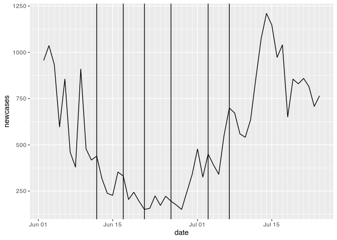
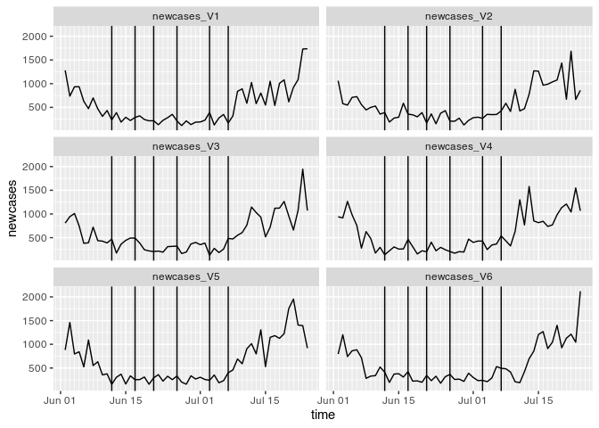

Epidemia simulation - Best case scenario (for finding an effect of
EURO2020)
================
Johannes Enevoldsen
8/25/2021

``` r
library(tidyverse)
```

    ## ── Attaching packages ─────────────────────────────────────── tidyverse 1.3.1 ──

    ## ✓ ggplot2 3.3.5     ✓ purrr   0.3.4
    ## ✓ tibble  3.1.3     ✓ dplyr   1.0.7
    ## ✓ tidyr   1.1.3     ✓ stringr 1.4.0
    ## ✓ readr   2.0.1     ✓ forcats 0.5.1

    ## ── Conflicts ────────────────────────────────────────── tidyverse_conflicts() ──
    ## x dplyr::filter() masks stats::filter()
    ## x dplyr::lag()    masks stats::lag()

``` r
library(epidemia)
library(lubridate)
```

    ## 
    ## Attaching package: 'lubridate'

    ## The following objects are masked from 'package:base':
    ## 
    ##     date, intersect, setdiff, union

The idea here is to create a very strict simulation of what data would
look like if R(t) only varies with Delt% and on match days, and if every
infected test positive withing \~2-10 days.

# Prepare data

First we get some data.

``` r
cases <- read_csv(here::here("input/analysis.csv")) %>%
    mutate(week = week(date),
           wday = factor(wday(date, label = TRUE, week_start = 1), ordered = FALSE),
           masks = factor(masks),
           gatherlim = factor(gatherlim),
           ntests_sqrt = sqrt(ntests),
           newcases = ifelse(date < (min(date) + 15), NA, newcases))
```

    ## Rows: 6519 Columns: 11

    ## ── Column specification ────────────────────────────────────────────────────────
    ## Delimiter: ","
    ## chr  (3): country, masks, gatherlim
    ## dbl  (7): num_sequences, perc_sequences, newcases, ntests, vx, vx_full, match
    ## date (1): date

    ## 
    ## ℹ Use `spec()` to retrieve the full column specification for this data.
    ## ℹ Specify the column types or set `show_col_types = FALSE` to quiet this message.

``` r
cases_dk <- filter(cases, country == "denmark",
                   date > dmy("01-06-2021") - 15,
                   date < dmy("25-07-2021"))

cases_dk$newcases[1:15] <- NA

# convenient layers for plotting
geom_match_line <- geom_vline(xintercept = cases_dk$date[cases_dk$match == 1])

# Remove the days used for seeding the model
scale_x_rm_seed <- scale_x_date(limits = c(min(cases_dk$date[!is.na(cases_dk$newcases)]),
                                         max(cases_dk$date[!is.na(cases_dk$newcases)])), 
                                date_minor_breaks = "1 day")

ggplot(cases_dk, aes(date, newcases)) +
    geom_line() +
    geom_match_line +
    scale_x_rm_seed 
```

    ## Warning: Removed 15 row(s) containing missing values (geom_path).

<!-- -->

# Setup simple epidemia model

``` r
serial_interval <- EuropeCovid2$si
plot(serial_interval)
```

<!-- -->

``` r
inf2test <- dlnorm(1:20, log(5), log(1.4))
inf2test_1 <- inf2test / (sum(inf2test)) # Make it sum to 1
plot(inf2test_1)
```

<!-- -->

``` r
rt <- epirt(formula = R(country, date) ~ 1 + match +
                #masks + gatherlim + # restriction
                perc_sequences,
                #rw(prior_scale = 0.05)
            prior = normal(log(5), 0.1),
            prior_intercept = normal(log(2), 0.2), link = 'log')

obs <-  epiobs(formula = newcases ~ 1, #+ wday, #+ ntests_sqrt,# + offset(rep(1,93)),
               link = "identity",
               i2o = inf2test_1,
               #prior = normal(1.1, 0.2),
               prior = normal(5, 0.2), # we catch all cases
               ) # 75% of infected test positive

inf <- epiinf(gen = serial_interval,
              prior_seeds = normal(1000, 1500),
              seed_days = 15)
```

# Fit model

## Predicted positive test given the fitted model

``` r
plot_obs(fm_dk, type = "newcases") + 
    geom_match_line +
    scale_x_rm_seed
```

    ## Scale for 'x' is already present. Adding another scale for 'x', which will
    ## replace the existing scale.

    ## Warning: Removed 2 rows containing missing values (geom_bar).

<!-- -->

## R(t) given the fitted model

``` r
plot_rt(fm_dk) +
    scale_x_rm_seed
```

    ## Scale for 'x' is already present. Adding another scale for 'x', which will
    ## replace the existing scale.

    ## Warning: Removed 15 row(s) containing missing values (geom_path).

<!-- -->

## Infections predicted by the model

``` r
plot_infections(fm_dk) + 
    scale_x_rm_seed
```

    ## Scale for 'x' is already present. Adding another scale for 'x', which will
    ## replace the existing scale.

    ## Warning: Removed 15 row(s) containing missing values (geom_path).

<!-- -->

The model assumes a huge effect from the matches.

# Simulate positive tests with the model

Now we look at how many positive tests we should expect each day with
this very large number of infected on match days. We create just 6
simulations.

``` r
sim_dk <- posterior_predict(fm_dk, draws = 6)

sim_dk_samp <- tibble(time = sim_dk$time, newcases = as.data.frame(aperm(sim_dk$draws, c(2,1)))) %>% 
    unpack(newcases, names_sep = "_") %>% 
    pivot_longer(starts_with("newcases"), values_to = "newcases", names_to = "sim")
ggplot(sim_dk_samp, aes(time, newcases, groups = sim)) +
    geom_line() +
    geom_match_line +
    scale_x_rm_seed + 
    facet_wrap(~sim, ncol = 2)  
```

<!-- -->

We can also do 200…

``` r
sim_dk <- posterior_predict(fm_dk, draws = 200)

sim_dk_samp <- tibble(time = sim_dk$time, newcases = as.data.frame(aperm(sim_dk$draws, c(2,1)))) %>% 
    unpack(newcases, names_sep = "_") %>% 
    pivot_longer(starts_with("newcases"), values_to = "newcases", names_to = "sim")
ggplot(sim_dk_samp, aes(time, newcases, color = sim)) +
    geom_line(alpha = 0.2, show.legend = FALSE) +
    geom_match_line +
    scale_x_rm_seed
```

<!-- -->

Basically, the uncertainty in dispersion in time from infected to
positive test washes out the very high infection rate at each match day.
